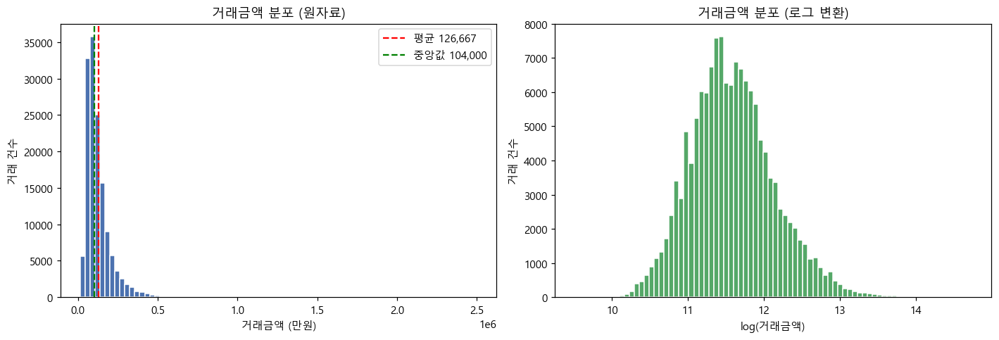
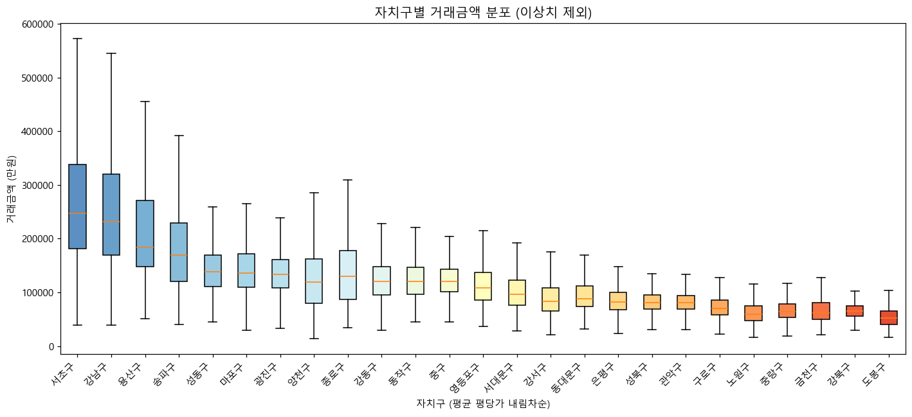
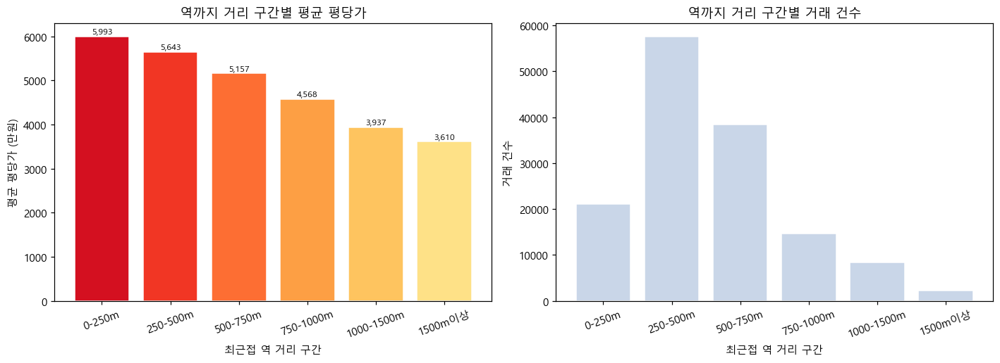
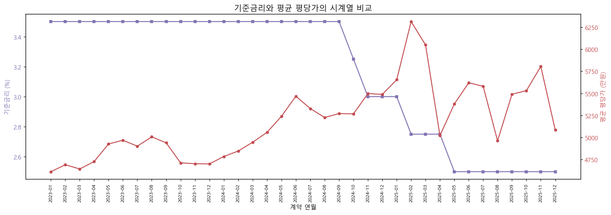
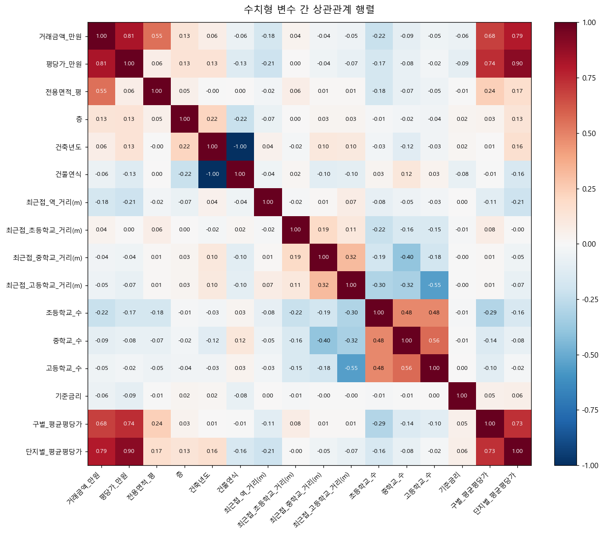
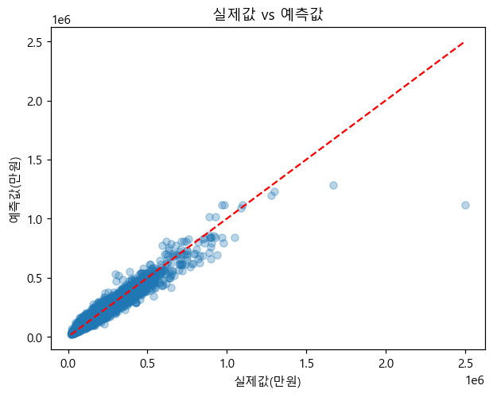

<div align="center">

# 🏙️ 서울 아파트 실거래가 가격 예측

**입지 · 면적 · 건물 특성 · 거시경제 변수를 결합한 머신러닝 기반 아파트 가격 분석**

2023–2025년 서울 아파트 매매 실거래가 **142,463건**을 분석하여 가격 결정 요인을 규명하고,
거래금액 예측 모델과 유사 아파트 추천 시스템을 구축한다.


데이터마이닝 A분반 2팀

</div>

---

## 📑 목차

[데이터셋](#-데이터셋) · [프로젝트 구조](#-프로젝트-구조) · [데이터 파이프라인](#-데이터-수집변수-생성) · [전처리](#-전처리) · [EDA](#-탐색적-데이터-분석-eda) · [모델링](#-모델링) · [실행 방법](#-실행-방법) · [팀](#-팀-구성)

---

## 📊 데이터셋

| 데이터 | 출처 | 기간 / 규모 |
|---|---|---|
| 아파트 매매 실거래가 | [국토교통부 실거래가 공개시스템](https://rt.molit.go.kr) | 2023.01–2025.12 / 서울 전역 |
| 서울 지하철역 좌표 | [서울 열린데이터광장](https://data.seoul.go.kr) | 수도권 역사 마스터 |
| 전국 초중등학교 위치 | [한국교육시설안전원](https://www.kits.or.kr) | 서울 학교 필터링 |
| 한국은행 기준금리 | [한국은행 ECOS](https://ecos.bok.or.kr) | 월별, 계약년월 매핑 |

**최종 분석 데이터**: `data/아파트_실거래_전처리_2023_2025.csv` — **142,463건 × 33개 변수, 결측치 0건**

> 🔎 **분석 기간 메모** — 초기 계획은 2022~2024년이었으나, 국토교통부가 2022년 거래의 동(棟) 정보를
> 공개하지 않아 "동 없는 행 제거" 전처리 규칙상 2022년이 전부 탈락했다. 대신 신고가 완결된 2025년을
> 추가하여 동일하게 **36개월 + 금리 변동 사이클**을 포함하도록 조정했다.

---

## 📁 프로젝트 구조

```
.
├── notebooks/
│   ├── 01_data_collection_pipeline.ipynb   # 수집 → 지오코딩 → 거리 변수 생성
│   ├── 02_preprocessing.ipynb              # 필터링 + 파생 변수 생성
│   └── 03_EDA_modeling.ipynb               # EDA + 모델 비교 + 변수 중요도 + 추천
├── data/
│   └── 아파트_실거래_전처리_2023_2025.csv    # 최종 전처리 데이터 (142,463건)
├── docs/
│   └── 데이터수집_담당파트.md                # 데이터 수집·변수 생성 상세 문서
└── assets/                                 # README용 그래프 (노트북 실행 결과)
```

---

## 🛠 데이터 수집·변수 생성

`01_data_collection_pipeline.ipynb`

- **효율적 지오코딩** — 거래 1건=1행 구조라 같은 단지가 수백 번 반복. 단지명+도로명 기준 **고유 단지만**
  좌표 변환 후 원본에 `join` → API 호출 **약 16배 절감** (성공률 99.7%)
- **API 전환** — 카카오 API는 테스트 앱 호출 한도 문제 → 일일 한도가 충분한 **VWorld API**로 전환
- **거리 변수 (haversine)** — 곡면 좌표이므로 유클리드 대신 haversine 공식 사용
  - 지하철: 최근접 역명·호선·거리 (서울 외곽은 인접 경기·인천 역이 더 가까울 수 있어 **수도권 전체** 후보)
  - 학교: 초/중/고 분리, 최근접 거리 + 반경 1km 내 학교 수
- **기준금리** — 월별 가로형 → 세로형 변환 후 계약년월 기준 매핑

---

## 🧹 전처리

`02_preprocessing.ipynb` — 원본 약 17.7만 건 → **142,463건**

**행 필터링**: 계약 해제 거래 · 지하층(`층<0`) · 불명 단지명 · 동 결측 · 좌표 결측 · 10평 미만 제거

**파생 변수 생성**

| 변수 | 산출 |
|---|---|
| `거래금액_만원` | `"175,000"` 문자열 → 정수 변환 |
| `전용면적_평` | 전용면적(㎡) ÷ 3.3058 |
| `평형대` | 10·20·30·40평 구간화 |
| `건물연식` / `건물연식_구분` | 계약연도 − 건축년도, 신축/준신축/중간/구축 |
| `평당가_만원` | 거래금액 ÷ 전용면적(평) |
| `구별_평균평당가`, `단지별_평균평당가` | 지역·단지 단위 평균 집계 |

---

## 🔍 탐색적 데이터 분석 (EDA)

### 거래금액 분포 — 우측 꼬리 (왜도 3.63)
평균(12.7억) > 중앙값(10.4억). 일부 초고가 거래가 평균을 끌어올리는 구조 → **종속변수 로그 변환** 근거.



### 자치구별 가격 — 가장 강한 요인
서초·강남(평당 약 9,900만원)과 도봉(약 2,700만원)의 격차 **약 3.7배**. 입지가 가격을 가장 강하게 설명.



### 지하철 접근성 — 역세권 효과
역과 가까울수록 평당가 단조 증가 (250m 이내 5,993 → 2km 초과 3,610만원).



### 기준금리 추이
2023~2024년 고금리 동결(3.50%) → 2024년 말부터 인하 → 2025년 2.50%. 금리 변동 사이클 포함.



### 변수 간 상관관계
평당가 계열·전용면적이 거래금액과 강한 상관. `건축년도`–`건물연식`은 거의 완전한 역상관(다중공선성) → 하나만 사용.



---

## 🤖 모델링

`03_EDA_modeling.ipynb` — 타깃 `거래금액` 로그 변환, 학습:테스트 = 8:2

### 모델 성능 비교 (5종)

| 모델 | MAE (만원) | RMSE (만원) | R² |
|---|---:|---:|---:|
| 선형 회귀 | 19,946 | 45,012 | 0.881 |
| K-최근접 이웃 | 9,748 | 18,015 | 0.961 |
| 랜덤 포레스트 | **7,059** | **12,972** | **0.979** |
| 그래디언트 부스팅 | 12,214 | 23,212 | 0.941 |
| **히스토그램 기반 부스팅** ✅ | 9,740 | 18,511 | 0.965 |

- **선형 회귀**가 가장 부진 → 가격의 비선형 구조를 못 잡음 (EDA의 연식 비선형성과 일치)
- **랜덤 포레스트**가 성능 1위지만 학습·예측 속도가 느림
- **히스토그램 기반 부스팅 채택** — 성능과 처리 속도의 균형이 우수 (서비스형 예측에 적합)

### 변수 중요도 → 최종 6개 입력 변수

permutation importance로 13개 변수 중 중요도 0.01 이상인 6개를 최종 입력 변수로 선택했다.

| 순위 | 변수 | 중요도 |
|---|---|---:|
| 1 | 단지별 평균평당가 | 0.527 |
| 2 | 전용면적(평) | 0.334 |
| 3 | 구별 평균평당가 | 0.276 |
| 4 | **기준금리** | 0.036 |
| 5 | 건물연식 | 0.033 |
| 6 | 최근접 역 거리 | 0.010 |

> 💡 **기준금리의 반전** — 단독 상관계수는 미미(약 −0.06)했으나 트리 모델 변수 중요도에서는 **4위**로
> 진입. 선형 상관으로는 잡히지 않지만 다른 변수와의 비선형·상호작용으로 가격에 작용함을 보여준다.
>
> ⚠️ **데이터 누수 방지** — 평당가(`거래금액/면적`)는 타깃 정보를 직접 포함하므로 입력에서 제외하고,
> 지역성·단지 특성을 요약하는 평균 평당가만 사용.

### 최종 성능 & 추천 시스템
- **MAE 10,173만원** (평균 거래금액 12.7억 대비 약 8%), RMSE 18,971만원
- RMSE > MAE 격차 → 일부 고가·특수 입지 거래에서 큰 오차



- **유사 아파트 추천**: `NearestNeighbors`로 입력 조건과 가장 가까운 5개 단지 제시

---

## ▶ 실행 방법

```bash
pip install pandas numpy matplotlib scikit-learn requests openpyxl
```

`notebooks/`의 노트북을 **01 → 02 → 03** 순으로 실행한다.
지오코딩(01)을 직접 돌리려면 VWorld API 키가 필요하며, 코드 내 `YOUR_VWORLD_API_KEY`를 발급받은 키로 교체한다.
전처리 완료 데이터가 `data/`에 포함되어 있어 **03번 EDA·모델링은 바로 실행 가능**하다.

---

## 👥 팀 구성

| 역할 | 담당 |
|---|---|
| 데이터 수집 | 정래원 |
| 전처리 | 김가연 |
| EDA | 김민성 |
| 모델링 | 정우진 |
| 발표 및 발표자료 | 김지호 |

---

## 📄 라이선스

본 저장소는 데이터마이닝 수업 학기말 프로젝트 결과물이다. 코드는 학습·참고 용도로 자유롭게 활용 가능하며,
원본 데이터는 각 제공기관(국토교통부·서울시·한국교육시설안전원·한국은행)의 이용 약관을 따른다.
